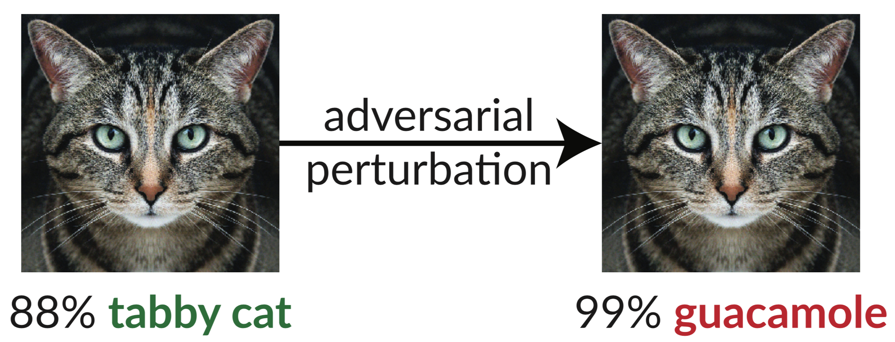

# Obfuscated Gradients Give a False Sense of Security: Circumventing Defenses to Adversarial Examples



Above is an [adversarial example](https://blog.openai.com/adversarial-example-research/): the slightly perturbed image of the cat fools an InceptionV3 classifier into classifying it as “guacamole”. Such “fooling images” are [easy to synthesize](http://www.anishathalye.com/2017/07/25/synthesizing-adversarial-examples/) using gradient descent ([Szegedy et al. 2013](https://arxiv.org/abs/1312.6199)).

In our recent paper, we evaluate the robustness of eight papers accepted to ICLR 2018 as defenses to adversarial examples. We find that seven of the eight defenses provide a limited increase in robustness and can be broken by improved attack techniques we develop.

Below is Table 1 from our paper, where we show the robustness of each accepted defense to the adversarial examples we can construct:

| Defense | Dataset | Distance | Accuracy |
|---|---|---|---|
| [Madry et al. (2018)](https://openreview.net/forum?id=rJzIBfZAb) | CIFAR | 0.031 (linf) | 47% |
| [Buckman et al. (2018)](https://openreview.net/forum?id=S18Su--CW) | CIFAR | 0.031 (linf) | 0%* |
| [Ma et al. (2018)](https://openreview.net/forum?id=B1gJ1L2aW) | CIFAR | 0.031 (linf) | 5% |
| [Guo et al. (2018)](https://openreview.net/forum?id=SyJ7ClWCb) | ImageNet | 0.007 (l2) | 1%* |
| [Dhillon et al. (2018)](https://openreview.net/forum?id=H1uR4GZRZ) | CIFAR | 0.031 (linf) | 0% |
| [Xie et al. (2018)](https://openreview.net/forum?id=Sk9yuql0Z) | ImageNet | 0.031 (linf) | 0%* |
| [Song et al. (2018)](https://openreview.net/forum?id=rJUYGxbCW) | CIFAR | 0.031 (linf) | 9%* |
| [Samangouei et al. (2018)](https://openreview.net/forum?id=BkJ3ibb0-) | MNIST | 0.005 (l2) | 0% |

(Defenses denoted with * also propose combining adversarial training; we report here the defense alone. See our paper, Section 5 for full numbers.)

The only defense we observe that significantly increases robustness to adversarial examples within the threat model proposed is “Towards Deep Learning Models Resistant to Adversarial Attacks” ([Madry et al. 2018](https://arxiv.org/abs/1706.06083)), and we were unable to defeat this defense without stepping outside the threat model. Even then, this technique has been shown to be difficult to scale to ImageNet-scale ([Kurakin et al. 2016](https://arxiv.org/abs/1611.01236)). The remainder of the papers rely either inadvertently or intentionally on what we call *obfuscated gradients*. Standard attacks apply gradient descent to maximize the loss of the network on a given image to generate an adversarial example on a neural network. Such optimization methods require a useful gradient signal to succeed. When a defense obfuscates gradients, it breaks this gradient signal and causes optimization based methods to fail.

We identify three ways in which defenses cause obfuscated gradients, and construct attacks to bypass each of these cases. Our attacks are generally applicable to any defense that includes, either intentionally or or unintentionally, a non-differentiable operation or otherwise prevents gradient signal from flowing through the network. We hope future work will be able to use our approaches to perform a more thorough security evaluation.

## Paper

**Abstract:**

We identify obfuscated gradients as a phenomenon that leads to a false sense of security in defenses against adversarial examples. While defenses that cause obfuscated gradients appear to defeat optimization-based attacks, we find defenses relying on this effect can be circumvented.

For each of the three types of obfuscated gradients we discover, we describe indicators of defenses exhibiting this effect and develop attack techniques to overcome it. In a case study, examining all defenses accepted to ICLR 2018, we find obfuscated gradients are a common occurrence, with 7 of 8 defenses relying on obfuscated gradients. Using our new attack techniques, we successfully circumvent all 7 of them.

For details, read our [paper](https://arxiv.org/abs/1802.00420).

## Source code

This repository contains our instantiations of the general attack techniques described in our paper, breaking 7 of the ICLR 2018 defenses. Some of the defenses didn't release source code, so we had to reimplement them. This repository contains our reimplementations as well.
We hope to have source code available shortly. **If you're a researcher and need access now, please email us, and we'll send you a copy of the code.**

## Citation

```
@unpublished{obfuscated-gradients,
  author = {Anish Athalye and Nicholas Carlini and David Wagner},
  title = {Obfuscated Gradients Give a False Sense of Security: Circumventing Defenses to Adversarial Examples},
  year = {2018},
  url = {https://arxiv.org/abs/1802.00420},
}
```
